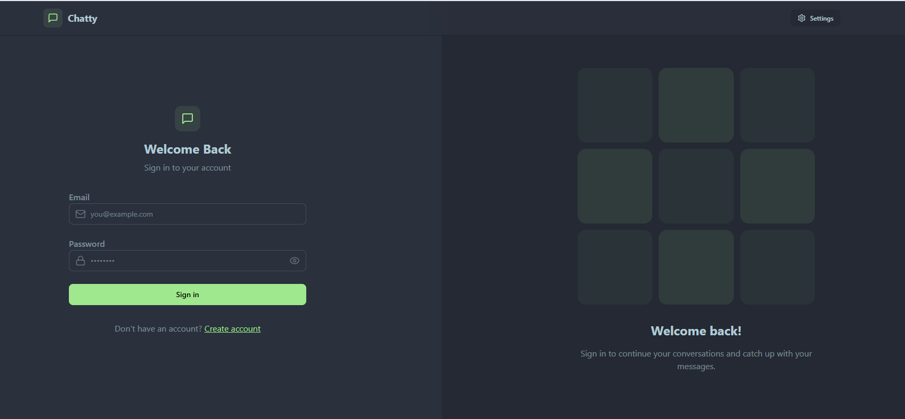
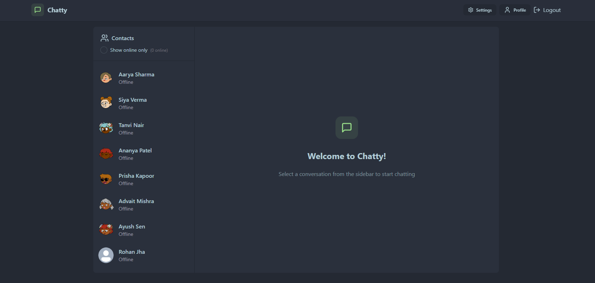
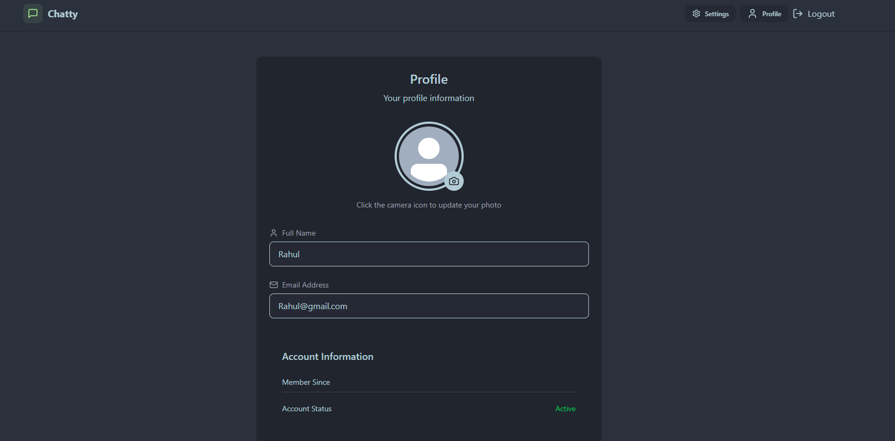

#  Chatify – Real-Time Chat Application

A full-stack real-time chat application built using the MERN stack and Socket.io. It enables instant bi-directional communication, secure access, and a sleek responsive interface.

---

##  Description

- Instant messaging through **Socket.io**, allowing real-time, event-driven bi-directional communication.
- Secure user authentication with **JWT**, with passwords hashed using **bcrypt**.
- Persistent message, user profile, and chat history storage in **MongoDB** via **Mongoose**.
- Clean, responsive UI implemented in **React** with styling using **Tailwind CSS**.
- Hosted seamlessly on **Render**.

---

##  Tech Stack

- **Frontend**: React, Tailwind CSS  
- **Backend**: Node.js, Express.js  
- **Database**: MongoDB, Mongoose  
- **Real-time Communication**: Socket.io  
- **Authentication**: JWT, bcrypt  
- **Deployment**: Render

---

##  Features

- Secure sign-up, login, and authenticated chat sessions.
- Bi-directional real-time messaging.
- Stores and retrieves chat history from the database.
- Responsive and intuitive UI.
- Smooth user experience with fast real-time communication.

---

## Deployed Version
See the live application here: https://chatify-real-time-chat-app-epe2.onrender.com/

---
## Future Enhancements
Group and direct messaging functionality

Typing indicators and online status

Read receipts and message delivery acknowledgments

Notification system (push/browser)

---
## Screenshots

